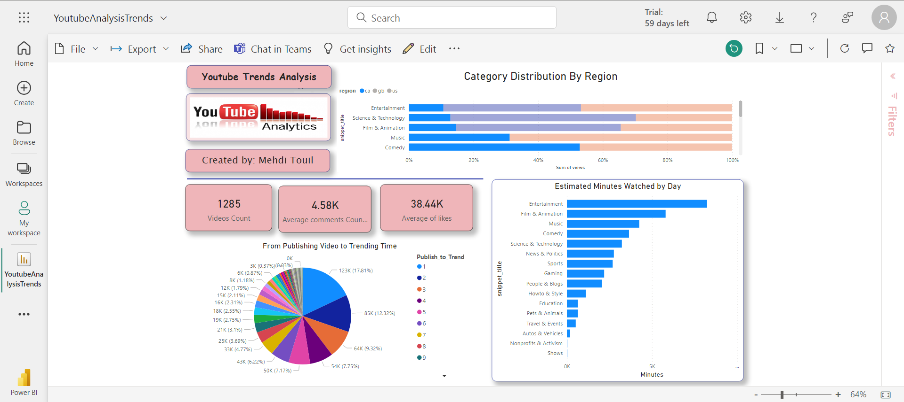

# YouTube Trends Analysis: End-to-End Data Engineering Project

This project aims to analyze trending videos across different regions using the AWS ecosystem and build a Power BI dashboard to answer key questions about video popularity factors.

## Project Overview

- **Data Engineering Lifecycle:**
  - The project follows a comprehensive data engineering lifecycle, encompassing data extraction, transformation, loading, and analysis.

- **Dataset:**
    - The dataset includes several months of data on daily trending YouTube videos from regions including the US, GB, DE, CA, FR, RU, MX, KR, JP, and IN. The dataset is sourced from [Kaggle](https://www.kaggle.com/datasets/datasnaek/youtube-new/).
- **Architecture:**

## Key Project Steps

1. **Introduction:**
   - Overview of the project and its importance.

2. **Learning Objectives:**
   - Detailed explanation of what participants will learn throughout the project.

3. **Understanding the Dataset:**
   - Exploration of the dataset used in the project.

4. **Data Processing:**
   - AWS Glue 
   - AWs Lambda

5. **AWS Services Utilized:**
   - Creation of IAM accounts and installation of AWS CLI.
   - Setting up an S3 bucket and uploading data.
   - Implementation of a Data Lake using Glue Crawler and Catalog.

6. **Querying and Analysis:**
   - Use of Athena and SQL for querying data.
   - Solving errors and preprocessing data.
   - Writing ETL jobs in Lambda for data cleaning.

7. **AWS Lambda and Layers:**
   - Understanding AWS Lambda and layers in the context of the project.

8. **Dashboard Creation:**
   - Querying cleaned data on Athena and visualizing it on Power BI.

## Data Engineering Lifecycle
1. **Data Lake Storage:**
   - Store Our Data to S3 Bucket.

1. **Data Processing and ETL:**
   - Trigger our  Aws lambda to Transforn Our Json files and clean them and store them in parquet format and  create a table to be queried in Athena.
   - Convert Our CSv Files to parquet and clean them and store them in a Table and Query in Athena.
   - All scripts are in scripts folder.

3. **Build Analytical Data:**
   - Use ETL Job to join our cleaned Tables for Writing final analytics table data to S3, partitioned by category_id.
3. **Build Dashboard using PowerBI:**
   - Build a dashboard in powerBi using ODBC as DataSource.

